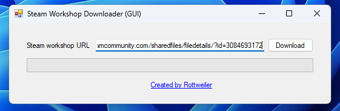

# Steam Workshop Downloader
Uses steamcmd.exe. Easy to use. Includes graphical interface.

# Example command line usage
Make sure the path to /steamcmd.exe is correct in the code.
```
steam-downloader.exe <id> -debug
steam-downloader.exe <id>
```

# Graphical usage
Make sure to set up the correct path to your projects in the code in Form1.cs. Just paste the link and hit download

# Screenshots
